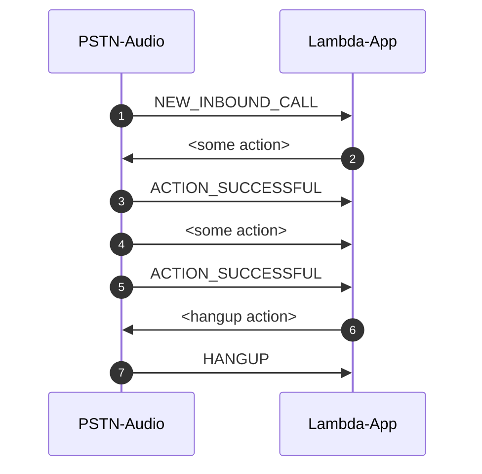
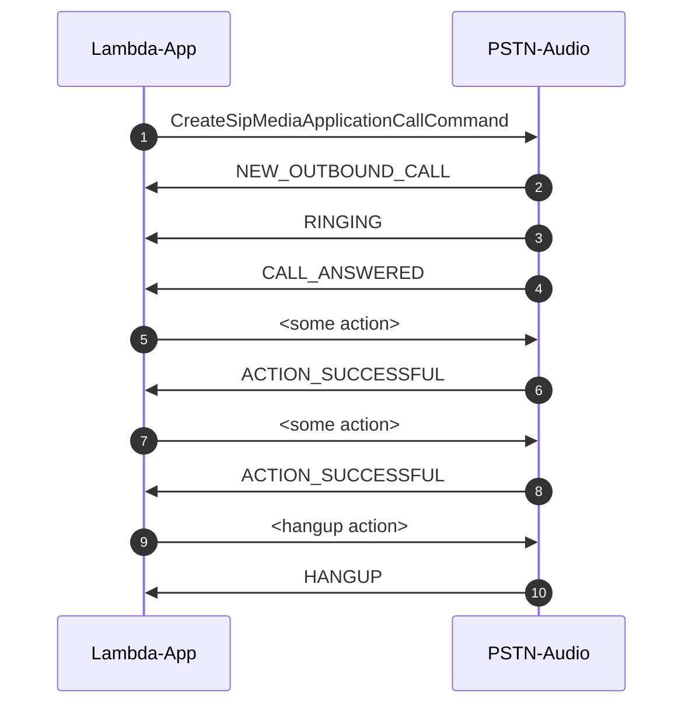
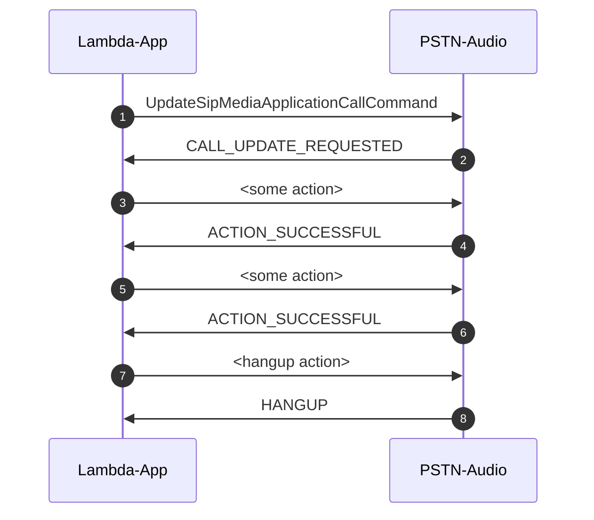

# Theory of Operation:  How PSTN Audio APIs and Interactions

PSTN Audio has three cloud objects:

* Phone Numbers
* SIP Media Appliance (SMA) - a software interface that connects phone events to  AWS Lambda (Lambda) functions
* SIP Rules - a software configuration that maps a phone number to an SMA

You can think about these as if they were other cloud objects, just like Amazon Simple Storage Service (S3) is a storage bucket.  They are created and destroyed either from the [Amazon Chime SDK Console](https://console.chime.aws.amazon.com/) or through scripts using the [Amazon Cloud Development Kit (CDK)](<https://aws.amazon.com/cdk/>).  Using the CDK, you can can manage these objects through the [cdk-amazon-chime-resources](https://www.npmjs.com/package/cdk-amazon-chime-resources) npm module.

## Three Interfaces

PSTN Audio uses three software intefaces:

* The SIP Media Appliance object (SMA) sends telephony "events" to a lambda
* The Lambda replies to "events" with "actions"
* API calls to the Amazon Chime SDK service

## Typical Incoming Call Interaction



## Typical Outbound Call Interaction


### Telephony Events

The SIP Media Appliance (SMA) sends [telephony "events"](https://docs.aws.amazon.com/chime/latest/dg/pstn-invocations.html) to the Lambda function registered with it.  

The generic format of these events is:

```json
{ 
    "SchemaVersion": "1.0", 
    "Sequence": 3, 
    "InvocationEventType": "event-type", 
    "CallDetails": { 
        "TransactionId": "transaction-id-1", 
        "AwsAccountId": "aws-acct-id-1", 
        "AwsRegion": "us-east-1", 
        "SipMediaApplicationId": "sip-media-app-id-1", 
        "Participants": [ 
            { 
                "CallId": "call-id-1", 
                "ParticipantTag": "LEG-A", 
                "To": "e164PhoneNumber", 
                "From": "e164PhoneNumber", 
                "Direction": "Inbound/Outbound", 
                "StartTimeInMilliseconds": "1641998241509", 
                "Status": "Connected/Disconnected" 
            } 
        ] 
    } 
}
```

The Lambda processes these events and returns an "action" (see below).  The "InvocationEventType" is the key that the code needs to act on.  Examples of these are:

* NEW_INBOUND_CALL
* NEW_OUTBOUND_CALL
* RINGING
* CALL_ANSWERED
* ACTION_FAILED
* HANGUP
* DIGITS_RECEIVED
* CALL_UPDATE_REQUESTED
* (other events ommited for brevity)

Please see the [documentation](https://docs.aws.amazon.com/chime/latest/dg/pstn-invocations.html) for the entire list.

It's worth pointing out that the Lambda function responds to events.  There is a special case where the customer code wants to interupt the SMA and force it to ask for new actions to perform.  That can be accomplished by calling the API function "UpdateSipMediaApplicationCallCommand" ([JavaScript](https://docs.aws.amazon.com/AWSJavaScriptSDK/v3/latest/clients/client-chime/classes/updatesipmediaapplicationcallcommand.html) and [Python](https://boto3.amazonaws.com/v1/documentation/api/latest/reference/services/chime.html#Chime.Client.update_sip_media_application_call)).  See the API Calls section for more details on API calls.  Calling that function includes a payload.  The SMA will be interupted and it will invoke a CALL_UPDATE_REQUESTED event and carry the payload.  The Lambda can then send new event(s) to the SMA.

### Lambda Actions

The Lambda processes events and returns "actions" as described in the [documentation](https://docs.aws.amazon.com/chime/latest/dg/specify-actions.html).  For example, to play a recorded audio file on a leg of a call, the action might look like this:

```json
{
    "SchemaVersion": "1.0",
    "Actions": [        
        {
            "Type": "PlayAudio",
            "Parameters": {
                "ParticipantTag": "LEG-A",
                "AudioSource": {
                    "Type": "S3",
                    "BucketName": "bucket-name",
                    "Key": "audio-file.wav"
                }
            }
        }
    ]
}
```

Examples of possible actions:  

* CallAndBridge
* Hangup
* JoinChimeMeeting
* ModifyChimeMeetingAttendee (muting and unmuting audio)
* Pause
* PlayAudio
* PlayAudioAndGetDigits
* ReceiveDigits
* RecordAudio

New actions recently released to support Amazon Lex (Lex), Amazon Polly (Polly) and Amazon Voice Focus:

* Speak - text-to-speech
* StartBotConversation - speech-to-text chat bot
* VoiceFocus - enable or disable noise reduction

These actions are fully described in the [documentation](https://docs.aws.amazon.com/chime/latest/dg/specify-actions.html).  We use a shorthand and say things like "actionHangup" when we are actually referring to the JSON object of that type.

### Lambda TransactionAttributes

TransactionAttributes enable Lambda developers to store application-specific information (examples:  call state, meeting IDs, attendee IDs, etc.).  These are stored in the SMA and transparently passed in the event object of every subsequent invocation for that session.  A session is for the lifetime of that call (inbound or outbound). This feature removes the need for customers to store this type of information in an external database like Amazon DynamoDB. 

The feature defines a new TransactionAttributes data structure, a JSON Object (<https://www.w3schools.com/js/js_json_objects.asp>) of key/value pairs. Customers can store whatever keys/values they want in TransactionAttributes. After they have been set, TransactionAttributes will be passed back in future Lambda invocations. The information is stored as up to 10 key-value pairs, of which each key or value has a maximum length of 1024 characters.

To modify the TransactionAttributes stored in memory, simply update the contents of the “TransactionAttributes” JSON Object with the desired mappings:

```json
{
    "SchemaVersion": "1.0",
    "Actions": [
        {
            "Type": "PlayAudio",
            "Parameters": {
                "ParticipantTag": "LEG-A",
                "AudioSource": {
                    "Type": "S3",
                    "BucketName": "chepa-sipmedia-app-iad",
                    "Key": "Welcome3.wav"
                }
            }
        }
    ],
    "TransactionAttributes": {
        "NewKey1": "NewValue1",
        "NewKey2": "NewValue2"
    }
}
```

If the contents of TransactionAttributes prior to this Lambda Invocation Response was:

```json
{
   "key1": "value1",
   "key2": "value2"
}
```

The contents of TransactionAttributes following this Lambda Invocation Response will be:

```json
{
   "NewKey1": "NewValue1",
   "NewKey2": "NewValue2"
}
```

#### Clearing TransactionAttributes

To clear the contents of the TransactionAttributes stored in memory, pass the TransactionAttributes field with an empty JSON Object:

```json
{
    "SchemaVersion": "1.0",
    "Actions": [
        {
            "Type": "PlayAudio",
            "Parameters": {
                "ParticipantTag": "LEG-A",
                "AudioSource": {
                    "Type": "S3",
                    "BucketName": "chepa-sipmedia-app-iad",
                    "Key": "Welcome3.wav"
                }
            }
        }
    ],
    "TransactionAttributes": {
    }
}
```

Passing the TransactionAttributes with a JSON null will NOT clear the TransactionAttributes:

```json
{
    "SchemaVersion": "1.0",
    "Actions": [
        {
            "Type": "PlayAudio",
            "Parameters": {
                "ParticipantTag": "LEG-A",
                "AudioSource": {
                    "Type": "S3",
                    "BucketName": "chepa-sipmedia-app-iad",
                    "Key": "Welcome3.wav"
                }
            }
        }
    ],
    "TransactionAttributes": null
}
```

Likewise, not passing TransactionAttributes will NOT clear the TransactionAttributes:

```json
{
    "SchemaVersion": "1.0",
    "Actions": [
        {
            "Type": "PlayAudio",
            "Parameters": {
                "ParticipantTag": "LEG-A",
                "AudioSource": {
                    "Type": "S3",
                    "BucketName": "chepa-sipmedia-app-iad",
                    "Key": "Welcome3.wav"
                }
            }
        }
    ]
}
```


### API Calls

Behavior that is not in response to an event requires that code somewhere (perhaps in the Lambda) make an API call to the Amazon Chime SDK service.  This service exposes a raw API over HTTP (not recommended), a Command Line Interface (CLI), and AWS SDK client libraries in many supported computer languages.  We will focus on [Python](https://boto3.amazonaws.com/v1/documentation/api/latest/reference/services/chime.html) and [TypeScript/JavaScript](https://docs.aws.amazon.com/AWSJavaScriptSDK/v3/latest/clients/client-chime/index.html) in this document.  The examples in this workshop are all TypeScript/JavaScript.

We mentioned an example above of triggering the SMA to send a CALL_UPDATE_REQUESTED event by using the "UpdateSipMediaApplicationCallCommand."  Another common command is used to make outbound phone calls.  In that case the "CreateSipMediaApplicationCall" API is used.  An example from the ["call and bridge"](../../lambdas/call-and-bridge/src/index.ts) lambda:

```typescript
async function makeDial(event: any) {
  console.log(event);
  var params = {
    FromPhoneNumber: event.CallDetails.Participants[0].To,
    SipMediaApplicationId: event.CallDetails.SipMediaApplicationId,
    ToPhoneNumber: event.CallDetails.Participants[0].From,
    SipHeaders: {},
  };
  console.info('params: ' + JSON.stringify(params));
  const command = new CreateSipMediaApplicationCallCommand(params);
  try {
    const response = await chimeClient.send(command);
  } catch (err) {
    console.log(err);
    return err;
  }
}
```

This function takes a HANGUP event and places a call back to the calling number.  You will notice that sending the command uses "await" to make it asyncronous.  This API call will trigger the SMA to start the outbound call, which will then send telephony events as that call progresses.  

It is beyond the scope of this workshop, but the API calls do not need to be to the same SMA for the same phone number.  The paremeters to the API call include the SMA ID.  If the code has access to the SMA ID of another SMA with a different phone number then a wholly differnt call flow could be triggered.  The lambda registerd with that other SMA would process the telephony events from that phone number.


## Action List Behavior

There are two kinds of actions: those that send an event on success, and those that don't. Regardless, the PSTN Audio Service will send an event when a list of actions is complete.  The PSTN Audio Service will execute the actions in the order returned from the customer lambda.  Events are sent to the customer lambda when any of the following occurs:  

* An action in the list fails
* All actions in the list have completed

An ACTION_SUCCESSFUL event will be sent to your lambda when any of the following actions succeed, even if there are still actions in the action list:

* CallAndBridge
* Hangup
* JoinChimeMeeting
* ModifyChimeMeetingAttendees
* PlayAudioAndGetDigits
* RecordAudio

If the Lambda responds to the successful event with any action, then any remaining actions in the prior action list will be replaced by that new action list.  If the Lambda responds to the successful event with no action data then the remaining actions in the previous list will continue to be taken.

#### Example 1

Your Lambda returns the following action list:  

[Pause, PlayAudio]  

If Pause fails during execution then your Lambda will be invoked with an ACTION_FAILED event and the PlayAudio action will not be executed. You may return a new action list to be executed.

#### Example 2

Your Lambda returns the following actions list:  

[PlayAudio, ReceiveDigits]  

If both actions succeed then your Lambda will be invoked and you may return a new action list to be performed.

#### Example 3

Your Lambda returns the following action list:
[Pause, CallAndBridge, PlayAudio]

When Pause succeeds the service will begin executing CallAndBridge. When CallAndBridge succeeds your Lambda would be invoked because CallAndBridge will send an ACTION_SUCCESSFUL when it succeeds.

If your Lambda then returned:

[Pause, RecordAudio]  

That would result in the PlayAudio action from the initial action list never being executed since a new action list was returned. Instead Pause and RecordAudio would execute.

If your Lambda instead returned an empty action list, then PlayAudio from the original action list would execute since it was still in the action list when CallAndBridge invoked the lambda and no action list was returned.

## Triggering the SMA to Send an Event

NOTE:  none of the example code in these workshops use this technique yet.  This is provided for information only.  Use cases for this include interupting an action in progress on the SMA due to some external event.

Typically the SMA only sends events as a result of telephony events on phone numbers.  However, you may need to interupt an SMA and trigger it to ask for new action. The call flow would look like this:



To trigger the SMA, use the UpdateSipMediaApplicationCallCommand and pass some data that you desire to be passed on to the SMA in the event.  Example:

```typescript
 async function sendUpdateSipMediaApplicationCallCommand(SipMediaApplicationId, TransactionId, keyFile, endFlag) {
    const chimeClient = new ChimeClient({ region: "REGION" });
    let params = {
      SipMediaApplicationId: SipMediaApplicationId,
      TransactionId: TransactionId,
      Arguments: {
        nextPlayFile: keyFile,
        bucketName: s3AnnounceBucketName,
        endCall: JSON.stringify(endFlag),
      }
    }
    const command = new UpdateSipMediaApplicationCallCommand(params);
    try {
      const response = await chimeClient.send(command);
      return true;
    } catch (error) {
      console.log("Error updating SMA: ", error);
      return false;
    }
  }
}
```

This will prompt the SMA to send an CALL_UPDATE_REQUESTED event to the lambda.  The "Arguments" object in the call will be passed verbatim to the SMA as payload in the event.  

## AWS Identity Access and Management (IAM) Permissions

There are two resources that interact with other AWS cloud resources:  the Lambda function and the SMA.  Any behavior that is triggered by an action will be carried out by the SMA.  Thus, the SMA needs to have appropriate IAM permission.  In the example above, to play a file that is stored in an S3 bucket, the SMA requires permission to read that bucket.  An example of a full permission might look like:

```json
{
    "Version": "2012-10-17",
    "Statement": [
        {
            "Sid": "SMARead",
            "Effect": "Allow",
            "Principal": {
                "Service": "voiceconnector.chime.amazonaws.com"
            },
            "Action": [
                "s3:GetObject"
            ],
            "Resource": "arn:aws:s3:::bucket-name/*",
                "Condition": {
                "StringEquals": {
                    "aws:SourceAccount": "aws-account-id",
                    "aws:SourceArn": "arn:aws:region:aws-account-id:sma/sip-media-application-id"
                }
            }
        }
    ]
}
```

In the lessons of this workshop, we usually set all the permissions in the "Chime Stack" in the parent folder "lib" directory.  However, since not all examples use S3, we only set those permissions in the CDK for that example.  We do this like this:

```typescript
  const wavFileBucketPolicy = new iam.PolicyStatement({
      effect: iam.Effect.ALLOW,
      actions: [
        's3:GetObject',
      ],
      resources: [
        wavFiles.bucketArn,
        `${wavFiles.bucketArn}/*`
      ],
      sid: 'SIPMediaApplicationRead',
    });
    wavFileBucketPolicy.addServicePrincipal('voiceconnector.chime.amazonaws.com');
    wavFiles.addToResourcePolicy(wavFileBucketPolicy);
```

The SMA needs permission to use Polly as well.  Even though not all examples need Polly, we grant that permission in the parent CDK script:

```typescript
  const pstnPollyRole = new iam.Role(this, 'pstnPollyRole', {
      assumedBy: new iam.ServicePrincipal('voiceconnector.chime.amazonaws.com'),
    });
    pstnPollyRole.addToPolicy(new iam.PolicyStatement({
      effect: iam.Effect.ALLOW,
      resources: ['*'],
      actions: ['polly:SynthesizeSpeech'],
    }));
```

The examples that show how to use Lex put the permissions for calling Lex into the Lex bot configuration, so that is not covered here.
