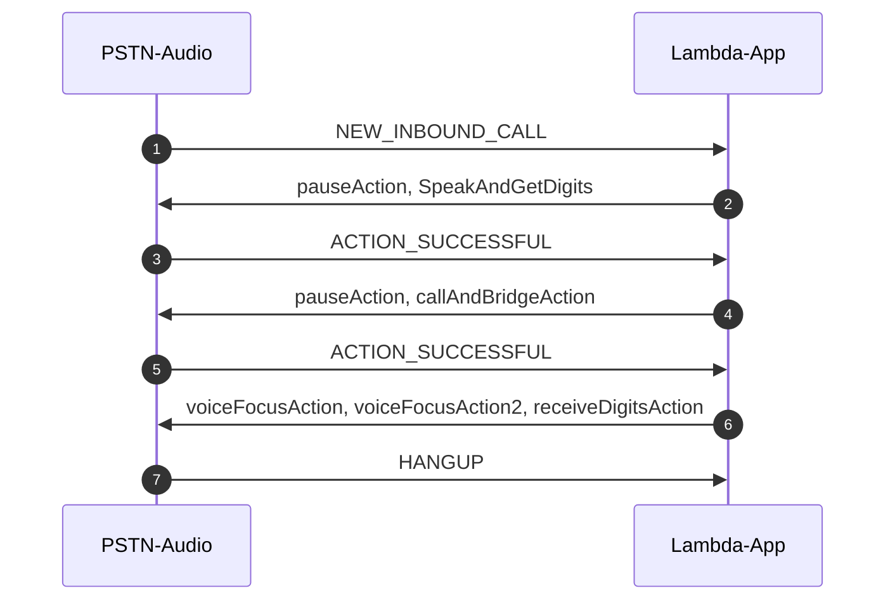

# Example 3: Call and Bridge (with Voice Focus)

[Previous Lesson](../call-me-back/README.md)  
[Next Lesson](../call-lex-bot/README.md)  

## Overall Behavior

The application will answer the phone, play a message prompting you to enter a phone number, collect those digits, dial that number, and when connected will listen for a 1 to enable Amazon Voice Focus, or a 0 to disable it.  Like in our previous example, the code will use Amazon Polly for voice prompts.  We do include a recording of a "ringing tone" (ringback tone, in PSTN terms) to provide indication that the called number is ringing.
## Operation

This example application takes advantage of the "Call Bridging" feature of PSTN Audio.  The call is first answered, but instead of a Speak action event we will use SpeakAndGetDigits. This will play the voice and collect keypad presses.

```typescript
function newCall(event: any) {
  const callId = event.CallDetails.Participants[0].CallId;
  speakCollectDigitsAction.Parameters.CallId = callId;
  speakCollectDigitsAction.Parameters.InputDigitsRegex = "^[1][0-9][0-9][0-9][0-9][0-9][0-9][0-9][0-9][0-9][0-9]";
  speakCollectDigitsAction.Parameters.SpeechParameters.Text = "<speak>Hello!  Please enter the number you would like to call, starting with a one followed by ten digits</speak>";

  return [pauseAction, speakCollectDigitsAction];
}
```
The regex controls what pattern of digits we expect.  In this case we expect a 1 followed by 10 numbers.  It's worth looking at the rest of the object though:

```typescript
const speakCollectDigitsAction = {
  Type: "SpeakAndGetDigits",
  Parameters: {
    CallId: "call-id-1",          // required
    InputDigitsRegex: "", // optional
    SpeechParameters: {
      Text: "<speak>Hello World</speak>",      // required
      Engine: "neural",         // optional. Defaults to standard
      LanguageCode: "en-US",    // optional
      TextType: "ssml",         // optional
      VoiceId: "Joanna",         // optional. Defaults to Joanna
    },
    FailureSpeechParameters: {
      Text: "<speak>Ooops, there was an error.</speak>",      // required
      Engine: "neural",         // optional. Defaults to the Engine value in SpeechParameters
      LanguageCode: "en-US",    // optional. Defaults to the LanguageCode value in SpeechParameters
      TextType: "ssml",         // optional. Defaults to the TextType value in SpeechParameters
      VoiceId: "Joanna",        // optional. Defaults to the VoiceId value in SpeechParameters
    },
    MinNumberOfDigits: 11,         // optional
    MaxNumberOfDigits: 11,         // optional
    TerminatorDigits: ["#"],      // optional
    InBetweenDigitsDurationInMilliseconds: 5000,  // optional
    Repeat: 3,                    // optional
    RepeatDurationInMilliseconds: 10000           // required
  }
}
```

The parameters follow the examples in the Amazon Polly documentation for voices, and the [PlayAudioAndGetDigits](https://docs.aws.amazon.com/chime/latest/dg/play-audio-get-digits.html) for digit control.

When the digits are collected, they are delivered in an ACTION_SUCCESSFUL event.  Since that message is a common one, we inspect the event.ActionData.Type.  If it's the SpeakAndGetDigits result we can read the digits from the event and "bridge" the call.  Note that this does not call an API, this is a returned action message.

```typescript
function placeCall(event: any) {
  callAndBridgeAction.Parameters.CallerIdNumber = event.CallDetails.Participants[0].From;
  callAndBridgeAction.Parameters.RingbackTone.Key = "US_ringback_tone.wav";
  callAndBridgeAction.Parameters.Endpoints[0].Uri = "+" + event.ActionData.ReceivedDigits;
  return [pauseAction, callAndBridgeAction];
}
```

It's worth looking at the callAndBridgeAction object:
```typescript
const callAndBridgeAction = {
  Type: "CallAndBridge",
  Parameters: {
    CallTimeoutSeconds: 30,
    CallerIdNumber: "e164PhoneNumber", // required
    RingbackTone: { // optional
      Type: "S3",
      BucketName: wavFileBucket,
      Key: "audio_file_name"
    },
    Endpoints: [
      {
        Uri: "e164PhoneNumber", // required
        BridgeEndpointType: "PSTN" // required
      }
    ],
    CustomSipHeaders: {
      String: "String"
    }
  }
}
```

The key fields to notice is the RingbackTone object.  We have set the S3 bucket (exactly as we did in the first lesson) with a normal ringback tone recording.  Bridging calls does not result in NEW_OUTBOUND_CALL, RINGING, or ANSWERED events.  Instead, the ACTION_SUCCESSFUL message with the event.ActionData.Type field set to "CallAndBridge" will signal success.

You will note that we set Amazon voice Focus to be off for this call.  However, to enable a caller to toggle it on and off, we add another step.  We do a [ReceiveDigits](https://docs.aws.amazon.com/chime/latest/dg/listen-to-digits.html) to collect one (and only one) number, either a 0 or a 1.  You will note the function:

```typescript
function connectCall(event: any) {
  const callId = findParticipantCallId(event, "Inbound");
  const callId2 = findParticipantCallId(event, "Outbound");

  // disable Voice Focus initially
  voiceFocusAction.Parameters.CallId = callId;
  voiceFocusAction.Parameters.Enable = false;

  voiceFocusAction2.Parameters.CallId = callId2;
  voiceFocusAction2.Parameters.Enable = false;

  receiveDigitsAction.Parameters.CallId = callId;
  receiveDigitsAction.Parameters.InputDigitsRegex = "[0-1]$";
  return [voiceFocusAction, voiceFocusAction2, receiveDigitsAction];
}
```

Setting the Regex to "[0-1]$" will ensure that we only get a 0 or a 1.  Since this is a direct action not part of another action, we will get DIGITS_RECEIVED events when keypresses occur and we process them like this:

```typescript
function digitsReceived(event: any) {
  let actions: any;
  if (event.ActionData.Type = "ReceivedDigits") {
    voiceFocusAction.Parameters.CallId = findParticipantCallId(event, "Inbound");
    voiceFocusAction2.Parameters.CallId = findParticipantCallId(event, "Outbound");

    switch (event.ActionData.ReceivedDigits) {
      case "0":
        voiceFocusAction.Parameters.Enable = false;
        voiceFocusAction2.Parameters.Enable = false;
        break;
      case "1":
        voiceFocusAction.Parameters.Enable = true;
        voiceFocusAction2.Parameters.Enable = true;
        break;
    }
    receiveDigitsAction.Parameters.CallId = findParticipantCallId(event, "Inbound");
    receiveDigitsAction.Parameters.InputDigitsRegex = "[0-1]$";
    actions = [voiceFocusAction, voiceFocusAction2, receiveDigitsAction];
    return actions;
  }
}
```

Depending on if a 0 or 1 is pressed, we enable or disable Voice Focus on both the inbound and outbound leg of the call.

Hangups will be processed as seen in prior examples.

## Call Sequence Diagram (visible only on GitHub)



## Try It

Assuming you have already deployed the parent directory and provisioned Amazon Chime SDK PSTN resources, you can deploy this lambda and test it like this:

```bash
yarn deploy
yarn swap
```

As we learned in the [CDK Overview](../../docs/cdk-overview/) "yarn deploy" will do a CDK deploy of the lambda and "yarn swap" will do an "aws chime update-sip-media-application" command to set this lambda as the one that will be invoked when a call arrives.

You can see the CloudWatch log group using the command

```bash
yarn group
```

You can remind yourself of your PSTN Audio phone number with

```bash
yarn number
```

## Provisioning Notes

As im the first example, we provision S3 storage to support holding wave files.  However, in this case it's not voice prompts but rather a "ringing tone" (ringback tone) to indicate that the called number is ringing.  However, since CallandBridge does not result in events sent to the lambda, we provide that in the action itself.  The skeleton object in the code looks like this:

```typescript
const callAndBridgeAction = {
  Type: "CallAndBridge",
  Parameters: {
    CallTimeoutSeconds: 30,
    CallerIdNumber: "e164PhoneNumber", // required
    RingbackTone: { // optional
      Type: "S3",
      BucketName: wavFileBucket,
      Key: "audio_file_name"
    },
    Endpoints: [
      {
        Uri: "e164PhoneNumber", // required
        BridgeEndpointType: "PSTN" // required
      }
    ],
    CustomSipHeaders: {
      String: "String"
    }
  }
}
```

You can see that you place the ringback file in the "Key" field.  This file is deployed to S3 by the CDK scripts like we did in the [previous lesson](../call-me-back/README.md).     

You can get more information on the CDK deployment scripts in the [How It Works](../../docs/how-it-works/) section.

[Previous Lesson](../call-and-bridge/README.md)  
[Next Lesson](../call-lex-bot/README.md)
