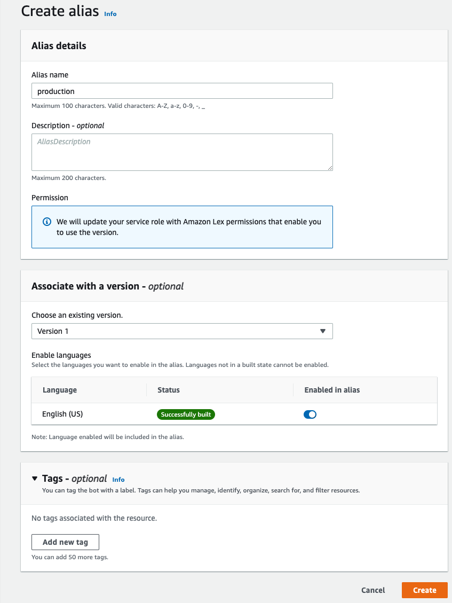
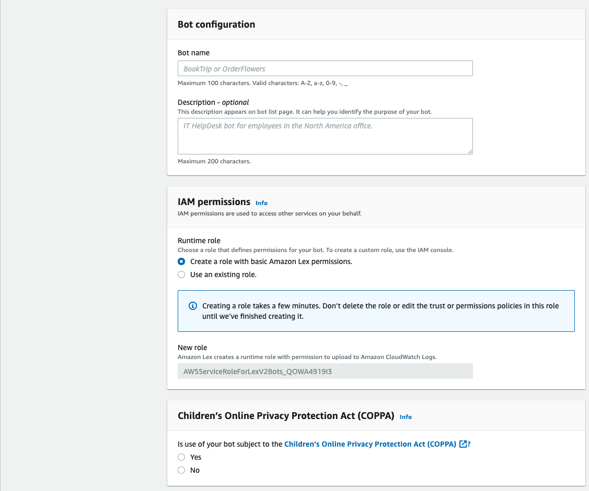
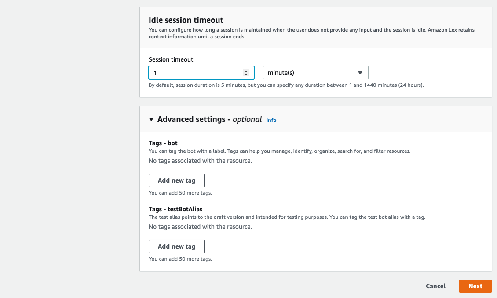
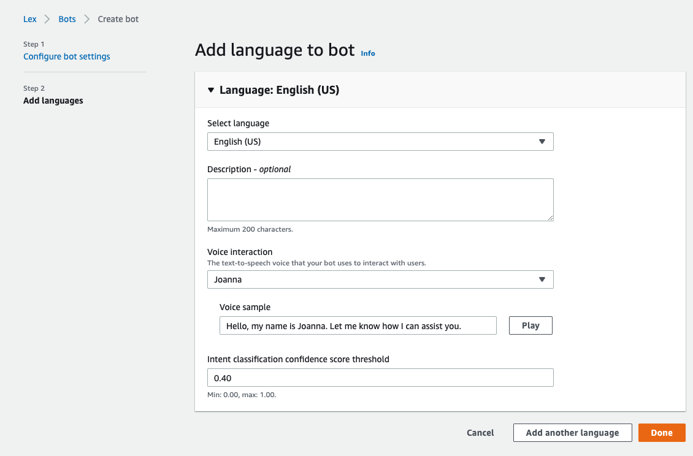
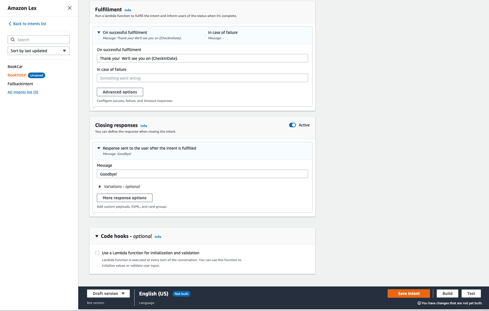
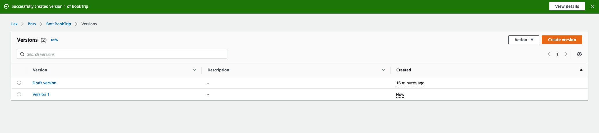
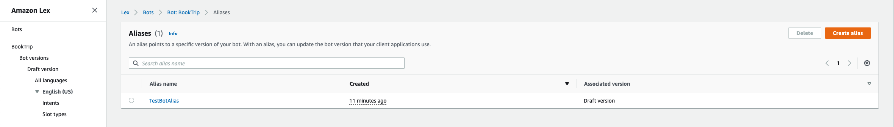
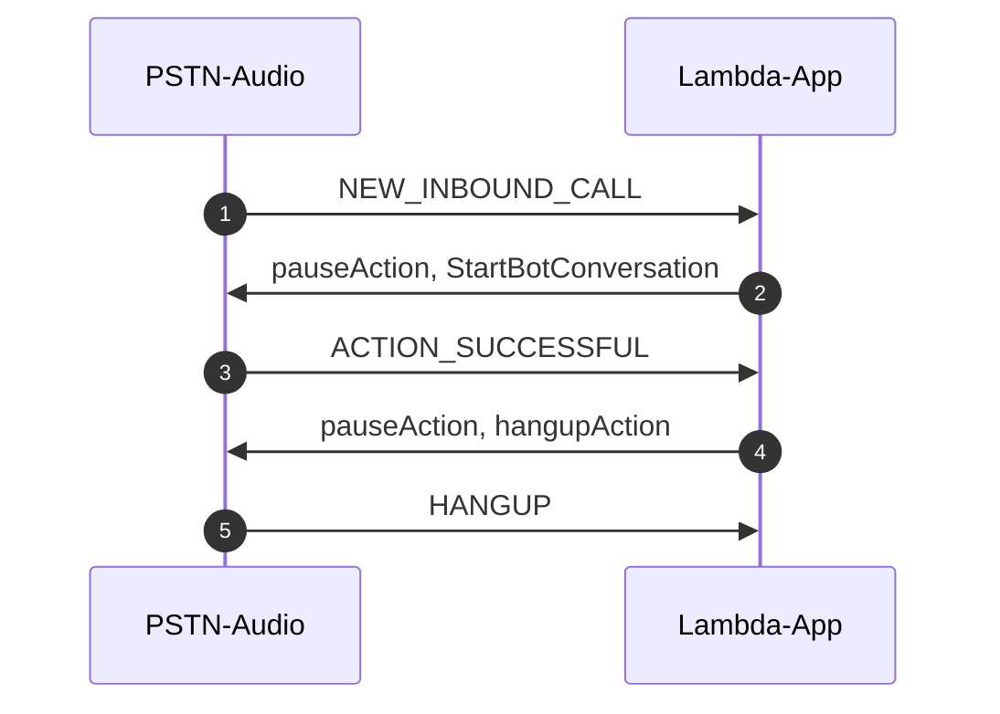

# Example 4: Call an Amazon Lex Bot

[Previous Lesson](../call-and-bridge/README.md)   

# Overall Behavior

The application will answer the phone and directly connect to an Amazon Lex bot.  The bot is the [standard Amazon Lex "book trip" example](https://docs.aws.amazon.com/lex/latest/dg/ex-book-trip.html).  The bot will prompt with several questions and then ask for confirmation.  

## Preparation:  Building the Bot

You can build a complete conversational voice bot using Amazon Lex.  In this example, you will use the Lex console to build a bot.  We will skip the steps where you build the lambda function that Lex calls.  This example is specifically how to connect Amazon Chime PSTN Audio to Lex.  Please see the [Lex documentation](https://docs.aws.amazon.com/lex/latest/dg/how-it-works.html) for details on how to build custom Lex bots.  In this example, we will leverage the built-in "book trip" example.

Log into the Amazon Lex console in the same region that you deployed the Amazon Chime SDK resources in.  This must be in either [us-east-1](https://us-east-1.console.aws.amazon.com/lexv2/home) or [us-west-2](https://us-west-2.console.aws.amazon.com/lexv2/home).  Select "Bots" from the left menu.  

### Create a Bot

Click "Create Bot" on the right of the Bots panel.  In the new page select "Start with an Example."  



Scroll down to "Bot Configuration" and enter a name for your bot ("BookTrip" for example).  The name does not matter, it's just for you to track the bot.  You can include an optional description.  Under IAM permissions, select "Create a role with basic Amazon Lex permissions."  Below that, in the section labeled "Children’s Online Privacy Protection Act (COPPA)" select "no" (this example will not need this protection, but for your own bot creation you should select that appropriately).




Scroll down to to "Idle session timeout" and reduce the Session Timeout to 1 minute.  For this demo program we don't need long timeouts.  Skip the Advanced Settings.  Click Next to advance to the next screen.  




On the "Add language to bot" page select the language you desire.  This example assumes English (US).  Under "Voice Interaction" select the voice that you would like.  You can click "Play" to play the test phrase to see if the voice is to your liking.  Leave the rest of the defaults and click Done.




You will now move to the "Intents" section.  Scroll down to "Fulfillment" and add the following text to "On successful fulfillment":

```bash
Thank you!  We'll see you on {CheckInDate}.
```

Scroll down to "Closing responses" and add the following text to "Message":

```bash
Goodbye!
```



Skip down to the bottom and click the orange "Save Intent" button.  Then click on the "Build" button.  It will take a few moments to build the bot.  When it completes you can test the bot using the console, if you desire.

### Create a Version

You have now built the bot, but you need to publish it as a version.  Navigate to the "Bot Versions" page (under your bot name).  Click the orange "Create version" button on the upper right.  You can accept all the default values and click the orange "Create" button in the lower right of the page.




### Create an Alias

Navigate to the "Aliases" page using the left panel.  Click the orange "Create alias" button.  Enter a name for the alias into the "Alias name" block ("production" or "test" for example).  In the "Associate with a version" block select "Version 1" from the dropdown box.  If you had more versions of your bot, they would appear here.  Click the orange "Create" button in the lower right corner.




You will return the Aliases screen.  Select the alias name you just entered ("production" for example).  This will expand into a page about that Alias.  Scroll down to "Resource-based policy" and click "Edit" to add a policy that will allow Chime SDK PSTN Audio to invoke Lex for you.  In the text box, paste the following.  You must then edit the JSON.

```json
{
  "Version": "2012-10-17",
  "Statement": [
    {
      "Sid": "SMALexAccess",
      "Effect": "Allow",
      "Principal": {
        "Service": "voiceconnector.chime.amazonaws.com"
      },
      "Action": "lex:StartConversation",
      "Resource": "<Resource-ARN-for-the-Alias>",
      "Condition": {
        "StringEquals": {
          "AWS:SourceAccount": "<account-num>"
        },
        "ArnEquals": {
          "AWS:SourceArn": "arn:aws:voiceconnector:<region>:<account-num>:*"
        }
      }
    }
  ]
}
```
Replace the ""<Resource-ARN-for-the-Alias>" with the Resource ARN directly above the text box.  This is the ARN for the bot alias.  Replace "<account-num>" with your account number and "<region>" with the region you are deploying into (either us-east-1 or us-west-2).  That defines the ARN of the PSTN Audio control plane in your account.  Click "Save" to store the policy.

Click on the copy button for the "Resource ARN" again to copy it to your clipboard.  You will need it in the next step.

Congratulations!  You have configured a Lex bot!

### Actual Production use of a Bot

In a real chat-bot application, you would almost certainly implement a lambda function to process the intents.  This demo program is focussed on explaining how to connect to Amazon Chime SDK PSTN Audio, so we don't go into that level of detail.  The [documentation](https://docs.aws.amazon.com/lex/latest/dg/ex-book-trip-create-integrate.html) for implementing that kind of functionality explains how to do that.
###  Configuring Your Lambda to use the Lex Bot ARN.

Open the src/index.ts source code file for the lambda and edit the variable "botAlias" near the top of the file:

```typescript
const botAlias = "<Resource-ARN-for-the-Alias>";
```

Again, replace "<Resource-ARN-for-the-Alias>" with the ARN you copied to the clipboard.  You can now deploy the bot with a "yarn deploy" and swap the new lambda into PSTN Audio with "yarn swap."  You will also notice the welcome text in the startBotConversationAction object:

```typescript
const startBotConversationAction = {
  Type: "StartBotConversation",
  Parameters: {
    BotAliasArn: "none",
    LocaleId: "en_US",
    Configuration: {
      SessionState: {
        DialogAction: {
          Type: "ElicitIntent"
        }
      },
      WelcomeMessages: [
        {
          ContentType: "PlainText",
          Content: "Welcome to AWS Chime SDK Voice Service. Please say what you would like to do.  For example: I'd like to book a room, or, I'd like to rent a car."
        },
      ]
    }
  }
}
```

After doing a 'yarn deploy;yarn swap' calls to that number will cause Lex will start the bot and use Polly to read that text.  This gives the caller a greeting, and tells them what they should do next.

## Operation

This example adds more actions to what we learned in the ["Call and Bridge Call" lesson](../call-and-bridge/README.md).  The NEW_INBOUND_CALL event arrives and is processed the same way.  We enable Voice Focus (which will enhance the ability of Lex to understand words) and then immediately hand the incoming call off to the bot you send a "StartBotConversation" action.  An example of that action looks like this:

```json
{
    "SchemaVersion": "1.0",
    "Actions": [
        {
            "Type": "Pause",
            "Parameters": {
                "DurationInMilliseconds": "1000"
            }
        },
        {
            "Type": "VoiceFocus",
            "Parameters": {
                "Enable": true,
                "CallId": "2947dfba-0748-46fc-abc5-a2c21c7569eb"
            }
        },
        {
            "Type": "StartBotConversation",
            "Parameters": {
                "BotAliasArn": "arn:aws:lex:us-east-1:<account-num>:bot-alias/RQXM74UXC7/ZYXLOINIJL",
                "LocaleId": "en_US",
                "Configuration": {
                    "SessionState": {
                        "DialogAction": {
                            "Type": "ElicitIntent"
                        }
                    },
                    "WelcomeMessages": [
                        {
                            "ContentType": "PlainText",
                            "Content": "Welcome to AWS Chime SDK Voice Service. Please say what you would like to do.  For example: I'd like to order flowers."
                        }
                    ]
                }
            }
        }
    ]
}
```

When the bot returns an ACTION_SUCCESSFUL event, the data collected by the Lex bot is included in the event.  You will note that the collected data from the bot is included, and your lambda could use that data if needed.  An example might look like this:

```javascript
{
    "SchemaVersion": "1.0",
    "Sequence": 2,
    "InvocationEventType": "ACTION_SUCCESSFUL",
    "ActionData": {
        "IntentResult": {
            "SessionId": "2947dfba-0748-46fc-abc5-a2c21c7569eb",
            "SessionState": {
                "SessionAttributes": {},
                "Intent": {
                    "Name": "BookHotel",
                    "Slots": {
                        "RoomType": {
                            "Value": {
                                "OriginalValue": "deluxe",
                                "InterpretedValue": "deluxe",
                                "ResolvedValues": [
                                    "deluxe"
                                ]
                            },
                            "Values": []
                        },
                        "CheckInDate": {
                            "Value": {
                                "OriginalValue": "june first",
                                "InterpretedValue": "2022-06-01",
                                "ResolvedValues": [
                                    "2022-06-01"
                                ]
                            },
                            "Values": []
                        },
                        "Nights": {
                            "Value": {
                                "OriginalValue": "five",
                                "InterpretedValue": "5",
                                "ResolvedValues": [
                                    "5"
                                ]
                            },
                            "Values": []
                        },
                        "Location": {
                            "Value": {
                                "OriginalValue": "san francisco",
                                "InterpretedValue": "san francisco",
                                "ResolvedValues": [
                                    "san francisco"
                                ]
                            },
                            "Values": []
                        }
                    },
                    "State": "Fulfilled",
                    "ConfirmationState": "Confirmed"
                }
            },
            "Interpretations": [
                {
                    "NluConfidence": {
                        "Score": 1
                    },
                    "Intent": {
                        "Name": "BookHotel",
                        "Slots": {
                            "RoomType": {
                                "Value": {
                                    "OriginalValue": "deluxe",
                                    "InterpretedValue": "deluxe",
                                    "ResolvedValues": [
                                        "deluxe"
                                    ]
                                },
                                "Values": []
                            },
                            "CheckInDate": {
                                "Value": {
                                    "OriginalValue": "june first",
                                    "InterpretedValue": "2022-06-01",
                                    "ResolvedValues": [
                                        "2022-06-01"
                                    ]
                                },
                                "Values": []
                            },
                            "Nights": {
                                "Value": {
                                    "OriginalValue": "five",
                                    "InterpretedValue": "5",
                                    "ResolvedValues": [
                                        "5"
                                    ]
                                },
                                "Values": []
                            },
                            "Location": {
                                "Value": {
                                    "OriginalValue": "san francisco",
                                    "InterpretedValue": "san francisco",
                                    "ResolvedValues": [
                                        "san francisco"
                                    ]
                                },
                                "Values": []
                            }
                        },
                        "State": "Fulfilled",
                        "ConfirmationState": "Confirmed"
                    }
                },
                {
                    "Intent": {
                        "Name": "FallbackIntent",
                        "Slots": {}
                    }
                },
                {
                    "NluConfidence": {
                        "Score": 0.21
                    },
                    "Intent": {
                        "Name": "BookCar",
                        "Slots": {}
                    }
                }
            ]
        },
        "Type": "StartBotConversation",
        "Parameters": {
            "BotAliasArn": "arn:aws:lex:us-east-1:<account-num>:bot-alias/RQXM74UXC7/ZYXLOINIJL",
            "LocaleId": "en_US",
            "Configuration": {
                "SessionState": {
                    "DialogAction": {
                        "Type": "ElicitIntent"
                    }
                },
                "WelcomeMessages": [
                    {
                        "Content": "Welcome to AWS Chime SDK Voice Service. Please say what you would like to do.  For example: I'd like to order flowers.",
                        "ContentType": "PlainText"
                    }
                ]
            },
            "CallId": "2947dfba-0748-46fc-abc5-a2c21c7569eb"
        }
    },
    "CallDetails": {
        "TransactionId": "685af72e-fd74-4ea9-b1bd-9715099ae9e9",
        "AwsAccountId": "<account-num>",
        "AwsRegion": "us-east-1",
        "SipRuleId": "2e19ff5c-6298-4549-9a1b-2648272b6643",
        "SipMediaApplicationId": "d7439ce4-4f78-4f34-9d5e-f6cf6d850da6",
        "Participants": [
            {
                "CallId": "2947dfba-0748-46fc-abc5-a2c21c7569eb",
                "ParticipantTag": "LEG-A",
                "To": "+15626663539",
                "From": "+14155551212",
                "Direction": "Inbound",
                "StartTimeInMilliseconds": "1646881785536",
                "Status": "Connected"
            }
        ]
    }
}
```

## Call Sequence Diagram 



## Try It

Assuming you have already deployed the parent directory and provisioned Amazon Chime SDK PSTN resources, you can deploy this lambda and test it like this:

```bash
yarn deploy
yarn swap
```

As we learned in the [CDK Overview](../../docs/cdk-overview/) "yarn deploy" will do a CDK deploy of the lambda and "yarn swap" will do an "aws chime update-sip-media-application" command to set this lambda as the one that will be invoked when a call arrives.

You can see the CloudWatch log group using the command

```bash
yarn group
```

You can remind yourself of your PSTN Audio phone number with

```bash
yarn number
```

## Provisioning Notes


You can get more information on the CDK deployment scripts in the [How It Works](../../docs/how-it-works/) section.

[Previous Lesson](../../docs/cdk-overview/README.md)
[Next Lesson](../call-me-back/README.md)
