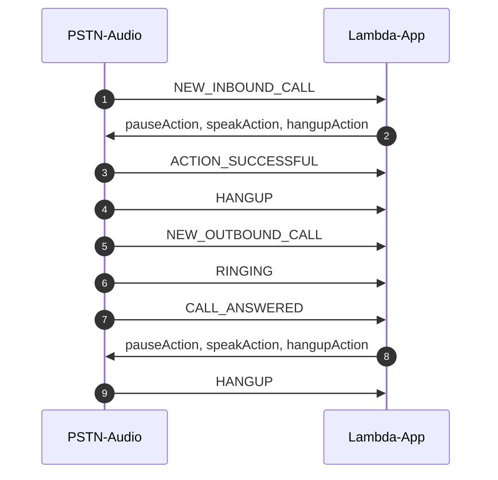

# Example 2: Call Me Back (with Amazon Polly)

[Previous Lesson](../call-play-recording/README.md)  
[Next Lesson](../call-and-bridge/README.md)

## Overall Behavior

The application will answer the phone, play a message, hang up, call you back, play a message, and hangup.  

## Operation

This example adds more actions to what we learned in the ["Call Recoded Message" lesson](../call-play-recording).  First of all we will use Amazon Polly to do text-to-speech.  The NEW_INBOUND_CALL event arrives and is processed the same way.  Only this time, we don't play a file from a bucket.  In fact, we didn't even add the bucket (see Provisioning Notes, below).
## Speaking

You will see that the behavior is set by configuring the speakAction.Parameters.Text value to a valid SSML string.  You can learn what tags are supported by Polly [here](https://docs.aws.amazon.com/polly/latest/dg/supportedtags.html).  The code looks like this:

```typescript
function newCall(event: any) {
  const from = event.CallDetails.Participants[0].From;
  speakAction.Parameters.Text = "<speak>Hello!  I will call you back!  Goodbye!</speak>";
  return [pauseAction, speakAction, hangupAction];
}
```

That's it!  You just used machine learning driven voice technology!  The action that directs the PSTN Audio service to speak the string is

```typescript
const speakAction = {
  Type: "Speak",
  Parameters: {
    Engine: "neural", // Required. Either standard or neural
    LanguageCode: "en-US", // Optional
    Text: "", // Required
    TextType: "ssml", // Optional. Defaults to text
    VoiceId: "Matthew" // Required
  }
}
```
Polly is natively intergrated into the PSTN Audio service.  You can learn more about the voice, languages, speach marks, and SSML at the [Polly documentation](https://docs.aws.amazon.com/polly/latest/dg/what-is.html).  You will note that the voice has been changed to a US male voice for this example.
## Calling You Back

When the line is hung up, the PSTN Audio service sends an event with the InvocationEventType set to HANGUP.  You process this like you did in the NEW_INBOUND_CALL case:

```typescript
 case 'HANGUP':
      console.log('HANGUP');
      if (event.CallDetails.Participants[0].Direction == 'Inbound') {
        actions = await makeDial(event);
      } else {
        console.log("Second hangup, task completed");
      }
      break;
```

We want to make sure we are detecting the HANGUP from an Inbound call.  If we acted on all HANGUP events then the application would just call you back every time it hung up!  We need to read some required values from the event object and we use those to set the parameters for the function call that will call you back.  This call is not actually a reply to the PSTN Audio service, but is rather an actual API call using the [AWS SDK for Javascript](https://docs.aws.amazon.com/AWSJavaScriptSDK/v3/latest/index.html).  The specific function we need to call is [CreateSipMediaApplicationCallCommand](https://docs.aws.amazon.com/AWSJavaScriptSDK/v3/latest/clients/client-chime/classes/createsipmediaapplicationcallcommand.html).  

The pattern for all these function calls is to set the command, then send it.  It's very important that you notice that these calls are asyncronous.  We take advantage of the the [await operator](https://developer.mozilla.org/en-US/docs/Web/JavaScript/Reference/Operators/await) to simplify our code.  This is "syntactic sugar" to make the code more readable by humans, even though under the hood it is a javascript promise being resolved.  Because of this, we need to wrap the async call in a ["try catch"](https://developer.mozilla.org/en-US/docs/Web/JavaScript/Reference/Statements/try...catch) block.  The code looks like this:


```typescript
unction makeDial(event: any) {
  console.log(event);
  var params = {
    FromPhoneNumber: event.CallDetails.Participants[0].To,
    SipMediaApplicationId: event.CallDetails.SipMediaApplicationId,
    ToPhoneNumber: event.CallDetails.Participants[0].From,
    SipHeaders: {},
  };
  console.info('params: ' + JSON.stringify(params));  // just for debugging
  const command = new CreateSipMediaApplicationCallCommand(params);
  try {
    const response = await chimeClient.send(command);
  } catch (err) {
    console.log(err);
    return err;
  }
}
```

The PSTN Audio service will then place an outgoing call back to you.  This will result in a series of invocations of the lambda, one for each event:  NEW_OUTBOUND_CALL, RINGING, and CALL_ANSWERED.  We show the code for logging those events, but we take no action for them until CALL_ANSWERED in this example  However, you can add code to process those events if needed.  When the CALL_ANSWERED event arrives we basically do the same action as in the last example:

```typescript
unction callAnswered(event: any) {
  const from = event.CallDetails.Participants[0].From;
  speakAction.Parameters.Text = "<speak>Hello!  I am just calling you back!  Goodbye!</speak>";
  return [pauseAction, speakAction, pauseAction, hangupAction];
}
```
Another HANGUP event will arrive, because the call did hang up.  Our code does not process this since its Direction is "Outbound."  The application ends.

## Call Sequence Diagram 




## Try It

Assuming you have already deployed the parent directory and provisioned Amazon Chime SDK PSTN resources, you can deploy this lambda and test it like this:

```bash
yarn deploy
yarn swap
```

As we learned in the [CDK Overview](../../docs/cdk-overview/) "yarn deploy" will do a CDK deploy of the lambda and "yarn swap" will do an "aws chime update-sip-media-application" command to set this lambda as the one that will be invoked when a call arrives.

You can see the CloudWatch log group using the command

```bash
yarn group
```

You can remind yourself of your PSTN Audio phone number with

```bash
yarn number
```
## Provisioning Notes

Since we did not need S3 to store recorded audio, we did not provision it in the CDK script.  You can get more information on the CDK deployment scripts in the [How It Works](../../docs/how-it-works/) section.

What we do need to do is ensure that our Lambda function has permission to interact with Amazon Polly.  In our CDK script, we add this snip:

```typescript
const pstnPollyRole = new iam.Role(this, 'pstnPollyRole', {
      assumedBy: new iam.ServicePrincipal('voiceconnector.chime.amazonaws.com'),
    });
    pstnPollyRole.addToPolicy(new iam.PolicyStatement({
      effect: iam.Effect.ALLOW,
      resources: ['*'],
      actions: ['polly:SynthesizeSpeech'],
    }));
```

This will allow the Lambda to call SynthesizeSpeech.


[Previous Lesson](../call-play-recording/README.md)  
[Next Lesson](../call-and-bridge/README.md)

