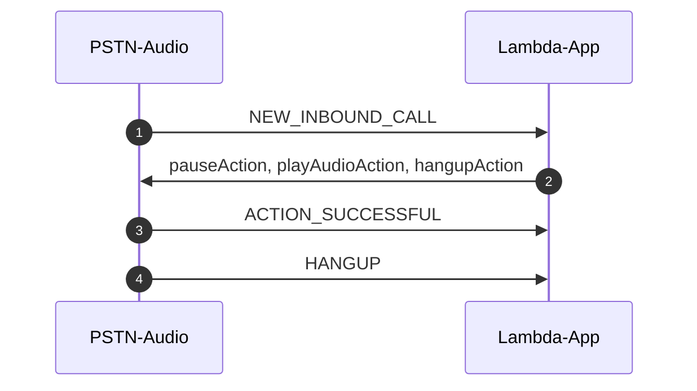

# Example 1: Call and Play Recorded Message

[Previous Lesson](../../docs/cdk-overview/README.md)  
[Next Lesson](../call-me-back/README.md)  

## Overall Behavior

The application will answer the phone, play a message from a file, then hang up.  
## Operation

This lambda is invoked when a call arrives at your provisioned phone number.  The lambda is invoked with a NEW_INBOUND_CALL event.  It can look like this:

```
2022-02-22T02:47:04.136Z b12cb386-2a4a-4809-94b9-026fcc8a32de INFO Lambda is invoked with calldetails:{
    "SchemaVersion": "1.0",
    "Sequence": 1,
    "InvocationEventType": "NEW_INBOUND_CALL",
    "CallDetails": {
        "TransactionId": "87111142-c672-4d09-aba2-6f55920ab76c",
        "AwsAccountId": "<accountnum>",
        "AwsRegion": "us-west-2",
        "SipRuleId": "cce5c298-4e61-4f6b-bf87-39cacfb5a15f",
        "SipMediaApplicationId": "9324457f-ad47-407d-bf45-5d409e714808",
        "Participants": [
            {
                "CallId": "409911e5-bfe6-40a5-8bdf-983f5ed5e0a1",
                "ParticipantTag": "LEG-A",
                "To": "+15053172485",
                "From": "+14155551212",
                "Direction": "Inbound",
                "StartTimeInMilliseconds": "1645498023381"
            }
        ]
    }
}
```

The code just has to match the InvocationEventType of NEW_INBOUND_CALL and call a function to play a media file.  The function sets the filename in the playAudioAction object and then sends three actions to the PSTN Service:  pauseAction, playAudioAction, and hangupAction.

```typescript
function newCall(event: any) {
  console.log("wavFileBucket: ", wavFileBucket);
  playAudioAction.Parameters.AudioSource.Key = "hello-goodbye.wav";
  return [pauseAction, playAudioAction, hangupAction];
}
```

## Call Sequence Diagram




## Extra:  TransactionAttributes

TransactionAttributes enable lambda developers to store application-specific information (examples:  call state, meeting IDs, attendee IDs, etc.).  These are stored in the SMA and transparently passed in the event object of every subsequent invocation for that session.  A session is for the lifetime of that call (inbound or outbound). This feature removes the need for customers to store this type of information in an external database like DynamoDB.  These attributes are covered in detail in the [How it Works](../../docs/how-it-works/README.md) document.  An example of the resulting object is:


```json
{
    "SchemaVersion": "1.0",
    "Actions": [
        {
            "Type": "Pause",
            "Parameters": {
                "DurationInMilliseconds": "1000"
            }
        },
        {
            "Type": "PlayAudio",
            "Parameters": {
                "Repeat": "1",
                "AudioSource": {
                    "Type": "S3",
                    "BucketName": "callplayrecordingstack-wavfiles98e3397d-lia3614txjpq",
                    "Key": "hello-goodbye.wav"
                }
            }
        },
        {
            "Type": "Hangup",
            "Parameters": {
                "SipResponseCode": "0",
                "ParticipantTag": ""
            }
        }
    ],
    "TransactionAttributes": {
        "key1": "val1*",
        "key2": "val2*",
        "key3": "val3*"
    }
}
```

You will see where we set those values in the code:

```typescript
   case "NEW_INBOUND_CALL":
      response.Actions = newCall(event);
      const attributes = {
        "key1": "val1*",
        "key2": "val2*",
        "key3": "val3*",
      }
      response.TransactionAttributes = attributes;
      break;
```      

And you can see in the next event from the SMA that those values are set:

```json
2022-03-08T00:55:55.124Z d632fbaf-194e-40bf-9d6e-6d1505341449 INFO Lambda is invoked with calldetails:{
    "SchemaVersion": "1.0",
    "Sequence": 2,
    "InvocationEventType": "HANGUP",
    "ActionData": {
        "Type": "Hangup",
        "Parameters": {
            "SipResponseCode": 0,
            "CallId": "0edf7af5-6934-4c3b-9c38-740e142974a3",
            "ParticipantTag": "LEG-A"
        }
    },
    "CallDetails": {
        "TransactionId": "f0e674d4-6b28-4597-85f3-b3c5cdb633c3",
        "TransactionAttributes": {
            "key1": "val1*",
            "key2": "val2*",
            "key3": "val3*"
        },
        "AwsAccountId": "497939524935",
        "AwsRegion": "us-east-1",
        "SipRuleId": "cdfcac4c-9d29-4416-9817-2bacf4a71ff1",
        "SipMediaApplicationId": "d408563b-4a60-4df7-bd59-82460adb1928",
        "Participants": [
            {
                "CallId": "0edf7af5-6934-4c3b-9c38-740e142974a3",
                "ParticipantTag": "LEG-A",
                "To": "+15054564891",
                "From": "+14153687546",
                "Direction": "Inbound",
                "StartTimeInMilliseconds": "1646700949660",
                "Status": "Disconnected"
            }
        ]
    }
}
```


## Try It!

Assuming you have already deployed the parent directory and provisioned Amazon Chime SDK PSTN resources, you can deploy this lambda and test it like this:

```bash
yarn deploy
yarn swap
```

As we learned in the [CDK Overview](../../docs/cdk-overview/) "yarn deploy" will do a CDK deploy of the lambda and "yarn swap" will do an "aws chime update-sip-media-application" command to set this lambda as the one that will be invoked when a call arrives.

You can see the CloudWatch log group using the command

```bash
yarn group
```

You can remind yourself of your PSTN Audio phone number with

```bash
yarn number
```

## Provisioning Notes

Something to note:  this example does have to have an S3 bucket provisioned in the CDK scripts.  The name of the bucket is passed to the lambda in it's WAVFILE_BUCKET environment variable on creation:

```typescript
    const smaLambda = new NodejsFunction(this, 'smaLambda', {
      entry: 'src/index.ts',
      handler: 'handler',
      bundling: {
        sourceMap: true,
        minify: false,
        externalModules: ['aws-sdk'],
        nodeModules: ['uuid',],
      },
      environment: {
        NODE_OPTIONS: '--enable-source-maps',
        WAVFILE_BUCKET: wavFiles.bucketName,
      },
      runtime: Runtime.NODEJS_14_X,
      role: applicationRole,
      timeout: Duration.seconds(60),
    });
```

In the CDK scripts, at deployment time we create the S3 bucket and deploy the files in our local "wav_files" folder to that bucket.  In the deployment script we do that with:

```typescript
  // create a bucket for the recorded wave files and set the right policies
    const wavFiles = new s3.Bucket(this, 'wavFiles', {
      publicReadAccess: false,
      autoDeleteObjects: true,
      removalPolicy: RemovalPolicy.DESTROY,
    });
    const wavFileBucketPolicy = new iam.PolicyStatement({
      effect: iam.Effect.ALLOW,
      actions: [
        's3:GetObject',
        // 's3:PutObject',
        // 's3:PutObjectAcl'
      ],
      resources: [
        wavFiles.bucketArn,
        `${wavFiles.bucketArn}/*`
      ],
      sid: 'SIPMediaApplicationRead',
    });
    wavFileBucketPolicy.addServicePrincipal('voiceconnector.chime.amazonaws.com');
    wavFiles.addToResourcePolicy(wavFileBucketPolicy);

    new s3deploy.BucketDeployment(this, "WavDeploy", {
      sources: [s3deploy.Source.asset("./wav_files")],
      destinationBucket: wavFiles,
      contentType: "audio/wav",
    });
```

You can get more information on the CDK deployment scripts in the [How It Works](../../docs/how-it-works/) section.

[Previous Lesson](../../docs/cdk-overview/README.md)
[Next Lesson](../call-me-back/README.md)
